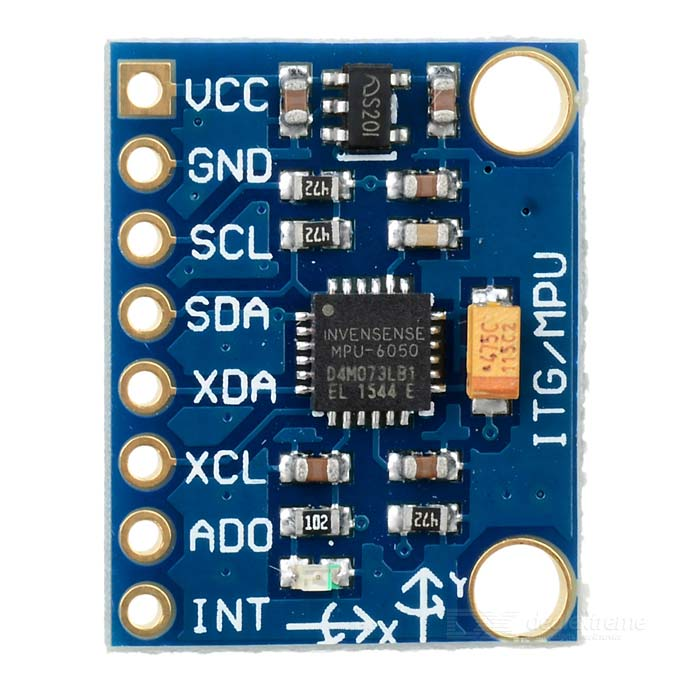
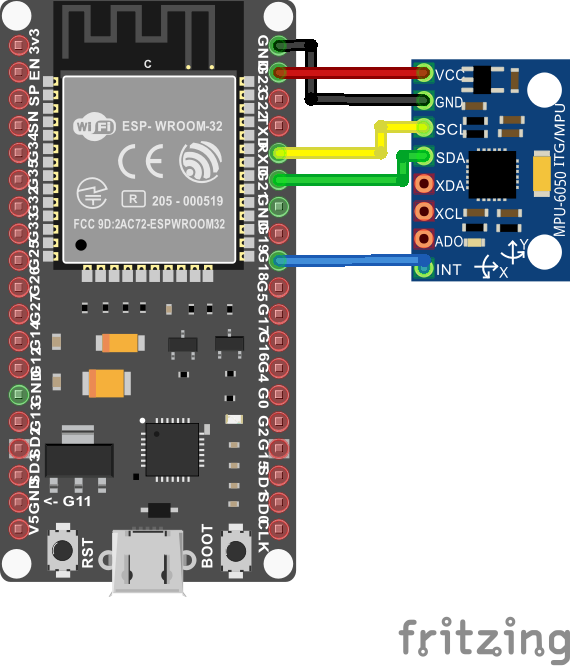
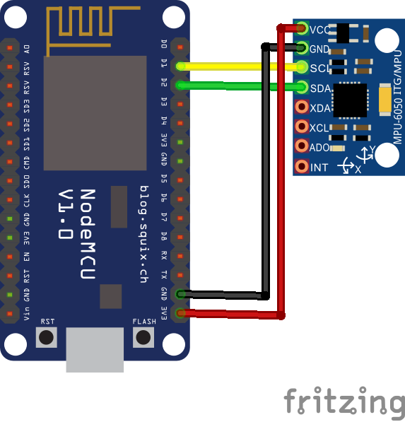

# IMU_WebServer_Quaternion

Test for Inertial Measurement Units **MPU6050** for robotic applications with Webserver. Testing Accuracy in reading and Filtering applying Roll Pitch Yaw Or **Quaternion** in order to visualize best method and results and avoid [Gimbal Lock](https://en.wikipedia.org/wiki/Gimbal_lock) effects.

## Quaternion Solution

Quaternion Solution

## FAIL - Gimbal Lock with RPY readings

Roll Pitch Yaw – No Quaternion Applied

## MPU6050

This giroscope and accelerometer module is needed in order to obtain **( accX, accY, accZ ) ( gyroX, gyroY, gyroZ )**.

## IMU Connection ESP32 with Interruption

## IMU Connection ESP8266 without Interruption

## Links

- [ZGZMakerSpace - Post](https://zaragozamakerspace.com/index.php/projects/quaternions-solving-gimbal-lock/)
- [RandomnerTutorials](https://randomnerdtutorials.com/esp32-mpu-6050-accelerometer-gyroscope-arduino/)
- [jrowberg MPU6050 Library](https://github.com/jrowberg/i2cdevlib/blob/master/Arduino/MPU6050/MPU6050_6Axis_MotionApps20.h)
- [3Blue1Brown - Quaternions](https://www.youtube.com/watch?v=d4EgbgTm0Bg)